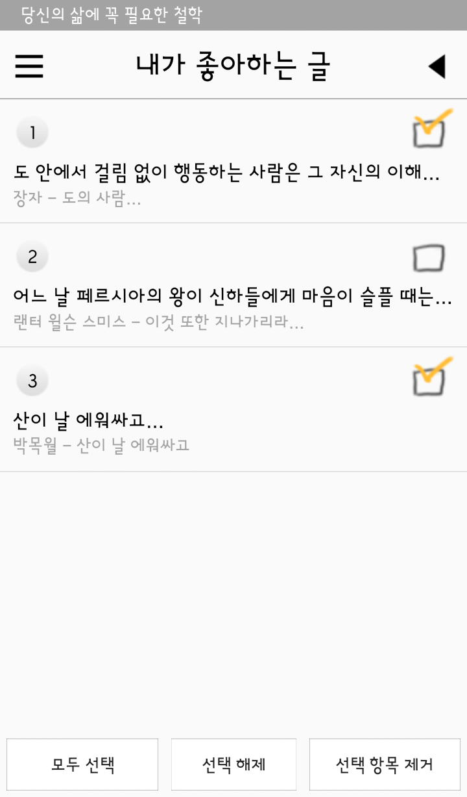

# 모두의 철학

### ★ 개요 SUMMARY
 > #### 1. 힘들고 지친 사람들에게 지금 자신의 상황에 맞는 철학, 명언 등의 글을 제공하는 앱입니다.
 > #### 2. SQLite 연동
 > #### 3. MenuDrawer 구현
 > #### 4. 즐겨찾기 기능 구현

 

### ★ 앱 이미지 App Image

 

 > ##### 1. 다양한 카테고리를 효과적으로 표시하기 위해 리스트뷰를 사용
</img>

 

 > ##### 2. 카테고리 중 하나를 선택하면 해당 카테고리의 리스트가 나온다, 마찬가지로 리스트뷰를 사용
</img>

 

 > #### 3. 글 하나 상세보기, ViewPager 효과를 적용
</img>

 

 > #### 4. 메뉴드로어를 이용한 메뉴화면
</img>

 

 > #### 5. 내가 좋아하는 글의 목록
</img>
